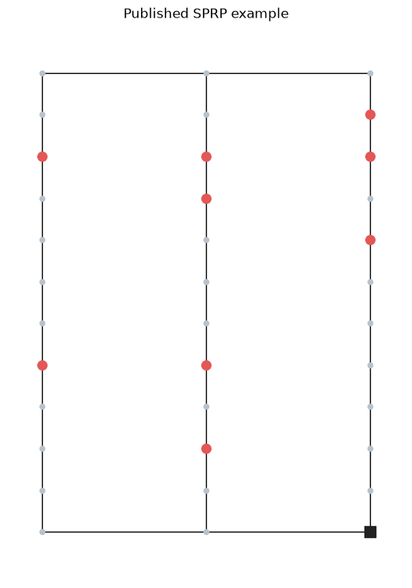
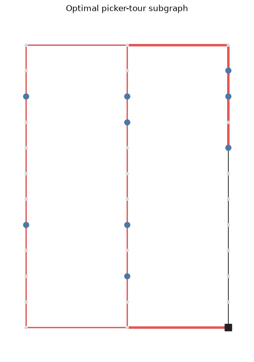

Examples
========

This page follows one warehouse problem from input facts to an algorithmic
result. The goal is to make the domain model, card matching, assignment, and
routing steps visible before introducing the smaller command-line examples.

The worked example: a warehouse you can inspect
------------------------------------------------

The :doc:`getting-started notebook <getting_started>` builds a conventional
single-picker warehouse directly from Python. It does not read a benchmark
file or hide the setup behind a loader. The instance has:

.. list-table::
   :header-rows: 1
   :widths: 32 18 50

   * - Part of the instance
     - Value
     - Why it matters
   * - Layout
     - 3 aisles, 10 pick locations
     - The graph determines which picker tours are possible.
   * - Depot
     - ``(3, 0)``
     - The route starts and ends at the bottom of aisle 3.
   * - Storage
     - 9 dedicated locations
     - Each requested article resolves to a physical pick node.
   * - Order
     - 9 unit-demand positions
     - The same pick list is passed to assignment and routing.
   * - Resource
     - 1 human picker, 9-item cart
     - The cart capacity is part of the domain, not an algorithm constant.

The first visualization shows those facts as a graph. Red nodes are pick
locations and the dark square is the depot.

What the model produces
~~~~~~~~~~~~~~~~~~~~~~~

``BaseWarehouseDomain`` keeps the six pieces together. The notebook prints the
following feature surface before any algorithm runs:

.. list-table::
   :header-rows: 1
   :widths: 28 28 22 22

   * - Component
     - Model
     - Type
     - Features
   * - layout
     - ``LayoutData``
     - conventional
     - 21
   * - articles
     - ``Articles``
     - standard
     - 3
   * - orders
     - ``OrdersDomain``
     - unit_demand
     - 6
   * - resources
     - ``Resources``
     - human
     - 7
   * - storage
     - ``StorageLocations``
     - dedicated
     - 6
   * - warehouse_info
     - ``WarehouseInfo``
     - offline
     - 0

The data-card representation of that domain is then matched against the
packaged algorithm cards. For this instance the mapper finds these distance-
based candidates:

.. list-table::
   :header-rows: 1
   :widths: 36 32 32

   * - Algorithm card
     - Subproblem
     - Objective
   * - ``GreedyIA``
     - item assignment
     - Distance
   * - ``ExactSolving``
     - routing
     - Distance
   * - ``LargestGap``
     - routing
     - Distance
   * - ``Midpoint``
     - routing
     - Distance
   * - ``NearestNeighbourhood``
     - routing
     - Distance
   * - ``Return``
     - routing
     - Distance
   * - ``SShape``
     - routing
     - Distance

This is the important separation: the domain describes what is available, the
cards describe what an algorithm needs, and the mapper decides which cards are
compatible before an implementation is executed.

From an article request to a route
~~~~~~~~~~~~~~~~~~~~~~~~~~~~~~~~~~

Greedy item assignment resolves the nine requested articles to these physical
pick nodes:

.. code-block:: text

   article  1  2  3  4  5  6  7   8   9
   node   (1,9) (1,4) (2,9) (2,8) (2,4) (2,2) (3,10) (3,9) (3,7)

The Ratliff--Rosenthal dynamic program then checks the published action
sequence and route length:

.. code-block:: text

   action sequence: 1pass, 11, 1pass, 22, top, 00
   route distance:   36

The second visualization overlays the optimal tour. A thicker edge means that
the picker traverses that segment twice.

Run the complete notebook with:

.. code-block:: bash

   uv run --locked --extra notebook jupyter lab examples/getting_started.ipynb

Because every value above is created in the notebook, changing one input—such
as the depot, a storage location, or the cart capacity—gives a concrete way to
observe how the matching and route result changes.

The small scripts
-----------------

After the worked example, the two focused scripts make the same ideas easy to
probe from a terminal:

``model_domain.py`` constructs a smaller two-aisle domain with 4 articles and
4 orders. Its picker has capacities of 6 items, 10 weight units, and 10 volume
units:

.. code-block:: bash

   uv run --locked python examples/model_domain.py

``batch_orders.py`` resolves the orders, applies FIFO batching, asserts that
each batch fits the cart, and prints the resulting loads:

.. code-block:: text

   Batch 0: orders=[1, 2], items=5, weight=8, volume=5
   Batch 1: orders=[3, 4], items=6, weight=10, volume=10

Run it with:

.. code-block:: bash

   uv run --locked python examples/batch_orders.py

The custom batching implementation is deliberately documented separately in
:doc:`extending`. That page answers how to add an algorithm; this page answers
what the domain values mean and how they become a compatible, measurable
solution.
